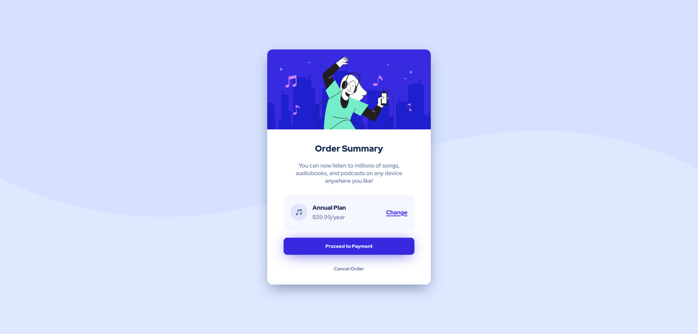

# Frontend Mentor - Order summary card solution

This is a solution to the [Order summary card challenge on Frontend Mentor](https://www.frontendmentor.io/challenges/order-summary-component-QlPmajDUj).

## Table of contents

- [Overview](#overview)
  - [The challenge](#the-challenge)
  - [Screenshot](#screenshot)
  - [Links](#links)
- [My process](#my-process)
  - [Built with](#built-with)
  - [What I learned](#what-i-learned)
  - [Continued development](#continued-development)
- [Author](#author)

## Overview

### The challenge

Users should be able to:

- See hover states for interactive elements

### Screenshot



### Links

- Solution URL: [Add solution URL here](https://gereltuyamz.github.io/order-card-component/)
- Live Site URL: [Add live site URL here](https://gereltuyamz.github.io/order-card-component/)

## My process

### Built with

- Semantic HTML5 markup
- CSS custom properties
- Flexbox

### What I learned

More clear understandidng of the box-shadow and write media-query in css

Example code snippets:

```css
.payment-btn {
	width: 80%;
	padding: 0.9rem 0;
	margin: 0.9rem 0;
	border-radius: 10px;
	background-color: hsl(245, 75%, 52%);
	color: hsl(225, 100%, 98%);
	border: none;
	font-family: "Red Hat Display", sans-serif;
	font-weight: 700;
	box-shadow: 0px 5px 40px -10px hsl(245, 75%, 52%);
	cursor: pointer;
	transition: 1s;
}

@media only screen and (max-width: 375px) {
	.hero-img {
		width: 330px;
	}
	.order-card {
		width: 330px;
	}
	p {
		font-size: 14px;
	}
	.change-link {
		font-size: 14px;
	}
	.content {
		padding: 0 2rem;
	}
}
```

### Continued development

I want to more focus on responsive design on my future projects, such as how to write clean css code and make it responsive on different screen 

## Author

- Frontend Mentor - [@GereltuyaMz](https://www.frontendmentor.io/profile/yourusername)
